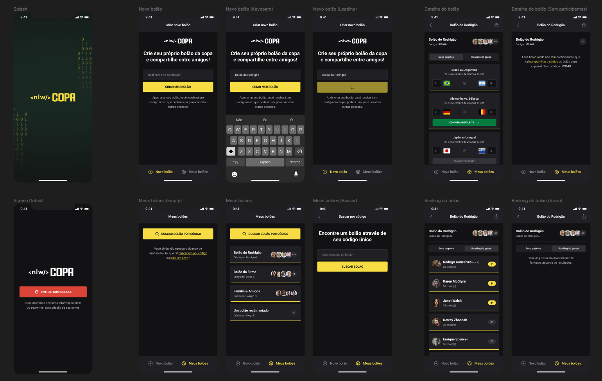

<p align='center'></p>
<h1 align='center'>Next Level Week - Copa</h1>
<p align='center'>


</p>

## 🔖 Descrição
<p>Desenvolvimento de uma aplicação de bolão com os jogos da copa, nessa Next Level Week foi desenvolvido a versão web, mobile e o server.<p>

## ⚙️ Funcionalidades
- Login utilizando conta Google
- Criação de bolões
- Entrada em bolões existentes
- Palpites para os jogos
- Ranking do grupo


## 🚀 Tecnologias
Esse projeto está utilizando as seguintes tecnologias:

- [NextJS](https://nextjs.org/)
- [Typescript](https://www.typescriptlang.org/)
- [Expo](https://expo.dev/)
- [Fastify](https://www.fastify.io/)


## 🎲 Como utilizar
### Clone esse repositório
```bash
git clone https://github.com/rafaasimi/copa-nextlevelweek.git
```
### Navegue até o diretório
```bash
cd copa-nextlevelweek
```

### Instale as dependências
```bash
npm i
```
```bash
yarn
```

### Inicie o servidor
```bash
cd server
yarn dev
```

### Inicie a aplicação web
```bash
cd web
yarn dev
```

### Inicie a aplicação mobile
```bash
cd mobile
yarn start
```
### Configurações mobile
```
- Criar o app no google para poder ter acesso ao OAuth (<https://docs.expo.dev/guides/authentication/#google>)

- Faça uma copia do arquivo `.env.example` para `.env` e preencha corretamente.

- Alterar o endereço do arquivo `src/services/api.ts` colocando o IP da máquina.

- Execute `yarn start` para iniciar o servidor do Expo.
```


## 🖼️ Layout



---
<p>Criado com 💙 por <a href='https://github.com/rafaasimi/' target='_blank'>Rafael Simionato</a></p>